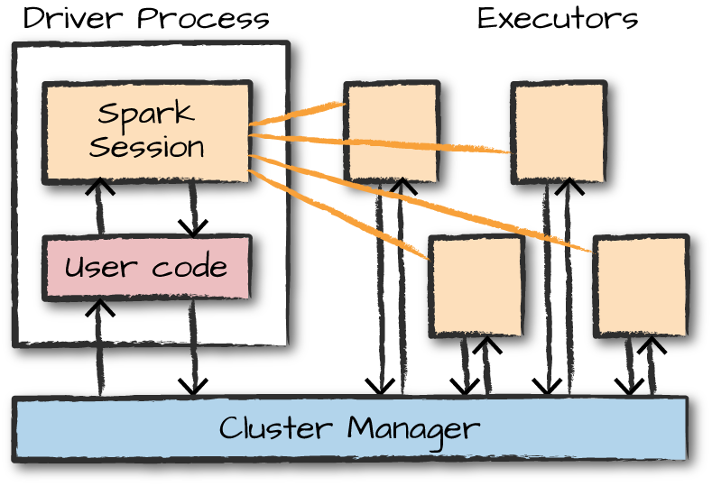

# Introduction

## What is Apache Spark ?

- Apache Spark is a unified computing engine and a set of libraries for parallel data processing on computer clusters.
- The cluster of machines that Spark will use to execute tasks is managed by a **cluster manager** like Spark’s standalone cluster manager, YARN, or Mesos.
- We then submit **Spark Applications** to these _cluster managers_, which will grant resources to our application so that we can complete our work.
- Spark is written in Scala, and runs on the Java Virtual Machine (JVM), so therefore to run Spark either on your laptop or a cluster, all you need is an installation of Java.
  - If you want to use the Python API, you will also need a Python interpreter

## Important Terms in PySpark

- `Dataframe` a distributed collection of data organised into named columns
- `Partitioning` a way to split the data into multiple partitions so that you can execute transformations on multiple partitions in parallel which allows completing the job faster.
- A `Partition` is a collection of rows that sit on one physical machine in your cluster. A DataFrame’s partitions represent how the data is physically distributed across the cluster of machines during execution.
- `Shuffle` movement of data accross partitions
- `RDD` Resilient Distributed Dataset - used for low level computations and unstructured data
- `Transformation` applying the function produces new RDD. Lazy in nature
- `Action` evaluate the corresponding transformations and action to show the result

## Spark Application

- Spark Applications consist of
  - A driver process: responsible for
    - maintaining information about the Spark Application
    - responding to a user’s program or input
    - analyzing, distributing, and scheduling work across the executors
  - A set of executor processes: responsible for
    - executing code assigned to it by the driver
    - reporting the state of the computation on that executor back to the driver node.

<p align="center"><br>The architecture of a Spark Application: how the cluster manager controls physical machines and allocates resources to Spark Applications</p>

### Starting a Spark application

- To start an interactive Spark Application:
  - `./bin/spark-shell` to access the Scala console
  - `./bin/pyspark` to access the Python console
- `spark-submit` to submit a precompiled standalone application to Spark
  - `spark-submit` offers several controls with which you can specify the resources your application needs as well as how it should be run and its command-line arguments.

```shell
./bin/spark-submit \
  --master local \
  ./pyspark_folder/src/main/python/pi.py 10
```

### Spark Application's Run Mode

- **Cluster mode**: The driver and executors are run on different machines and managed by cluster manager like YARN, Mesos
- **Local mode**: The driver and executors are simply processes, which means that they can live on the same machine or different machines.
  - In local mode, the driver and executurs run (as threads) on your individual computer instead of a cluster.
